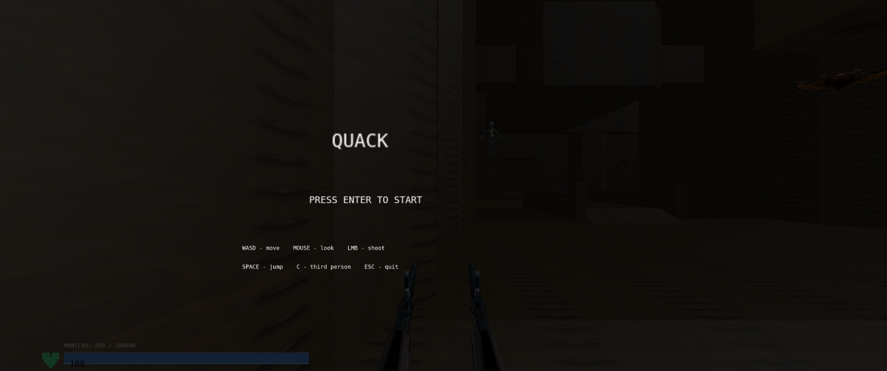
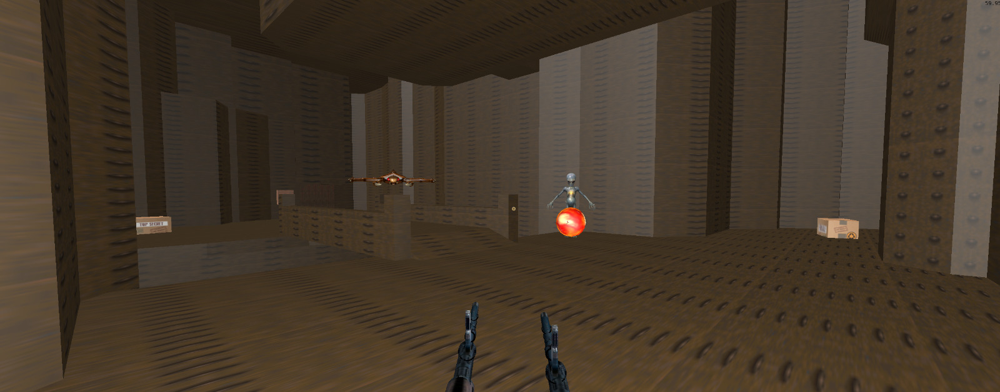

# Quake Clone (Quack) - INF01047 (Computação Gráfica e Visualização I)

## Descrição
O jogo desenvolvido é um FPS (First Person Shooter) inspirado em Quake, criado em C++ com OpenGL e outras bibliotecas de apoio. Ele possui um motor gráfico e físico próprio para renderizar modelos 3D, controlar colisões entre objetos e detectar interações, como os disparos do jogador. Os inimigos utilizam uma inteligência artificial simples baseada em estados, alternando entre diferentes comportamentos. O jogo também inclui animações da câmera e da arma para tornar a movimentação mais natural, além de uma interface (HUD) que exibe informações importantes ao jogador durante a partida.

## Contribuições da Dupla
Arthur - Atuou no desenvolvimento das principais partes do jogo, ajudando na documentação e na organização do projeto. Implementou a câmera em primeira pessoa, o carregamento dos modelos 3D e alguns efeitos visuais. Também desenvolveu a inteligência artificial inicial dos inimigos, o sistema de tiros e as animações da arma. Também foram implementadas a lógica das caixas de vida e munição, organizado o código das colisões em um arquivo separado e criado as condições de vitória e fim de jogo.
Eduarda - Implementação da câmera em terceira pessoa, melhora na iluminação, mostrar quando um tiro acerta o inimigo (com a cor vermelha) e muzzle flash dos tiros, fix nas colisões com degraus tanto do jogador quanto dos inimigos e inimigos mais agressivos, que perseguem melhor e empurram o jogador no contato físico. Implementou também os inimigos à distância - que atiram projéteis no jogador - e o sistema de hp do jogador e dos inimigos. Ademais, criou a tela inicial com os comandos, situações de game over e um objetivo final (botão) que leva a uma tela de vitória.

## Uso de Ferramentas de IA
Arthur - Apenas uso do Gemini através do navegador, de maneira que o LLM ajudou com erros de compilação entre versões do MinGW e também auxiliou na implementação de modelos 3D pelo mapa, links de onde encontrar o mapa da beta quake original (mapa usado no trabalho), e também no algoritmo dos disparos com curvas de bézier entre demais partes do código.
Eduarda - Utilizei o Claude integrado ao VSCode em boa parte do desenvolvimento, como para consertar as colisões e a iluminação. Tentei utilizar de maneira pedagógica - pedia para a IA fazer alguma coisa depois tentava entender o código, tirando dúvidas e fazendo alterações onde fosse pertinente.

## Imagens da Aplicação



*Figura 1: Visão em primeira pessoa mostrando a arma, os inimigos e o HUD de vida e munição.*



*Figura 2: Raycasting identificando objetos do cenário e exibindo informações no terminal.*

## Compilação e Execução

O projeto utiliza o build do **CMake**. Os passos a seguir guiam a compilação usando o compilador GCC/MinGW no Windows:

1. **Clonar o Repo:**
   ```bash
   git clone [URL_DO_SEU_REPOSITORIO]
   cd cgvis-trabalho-final

2. **Gerar os arquivos de Build:**   
   ```bash
   cmake -G "MinGW Makefiles" -S . -B build

3. **Compilar o Código:**   
   ```bash
   cmake --build build

4. **Rodar o jogo:**      
   ```bash
   ./bin/Debug/main.exe

Manual do Usuário

O controle do personagem é feito no estilo padrão de FPSs em geral, utilizando o teclado para movimentação e o mouse para rotação de câmera e disparos.

Controles de Movimentação e Ação:
    W, A, S, D: Movimenta o personagem pelos eixos X e Z (frente, trás, esquiva lateral).
    Espaço: Pulo.
    Shift Esquerdo: Aceleração/Strafe (conforme implementado).
    Botão Esquerdo do Mouse: Dispara o projétil da arma equipada.
    Movimento do Mouse: Controla o Pitch e Yaw da câmera.

Controles de Debug e Sistema:
    C: Alterna entre câmera em Primeira Pessoa e Terceira Pessoa.
    T: Dispara um raycast a partir da câmera que imprime no terminal o nome da malha 3D e o arquivo de textura do objeto mirado.
    G: Imprime no console as coordenadas globais exatas (X, Y, Z) do jogador no mapa.
    P / O: Alterna o modo da matriz de projeção da câmera (Perspectiva / Ortográfica).
    H: Oculta ou exibe o contador de FPS (Frames Per Second) no topo da tela.
    ESC: Encerra a aplicação.   

Vídeo de demonstração: https://youtu.be/XkkfEPidO90  